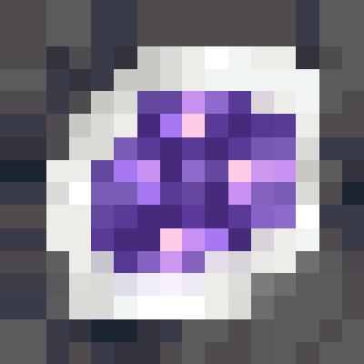

[![Discord Server][yeoxuhangs-server]][yeoxuhangs-invite]
[![Issues][issues-shield]][issues-url]
[![MIT License][license-shield]][license-url]
[![GeodePlus][geode-plus-mod]][geode-plus-page]
[![Lastest][lastest]][geode-plus-file]

 
 
 

  

<h1 align="center">Geode+</h1>

  <h2> About The Project</h2>

[![GeodePlus][product-screenshot]](https://www.curseforge.com/minecraft/mc-mods/geode-forge-fabric)

A mod that add geodes to Minecraft Overworld, Nether and even The End!

  

     

    <a href="https://github.com/YeoXuHang/Geode-Plus/issues">Report Bug</a>
    ·
    <a href="https://github.com/YeoXuHang/Geode-Plus/issues">Request Feature</a>
·
    <a href="https://github.com/YeoXuHang/Geode-Plus/blob/master/LICENSE">MIT License</a>
  

[issues-shield]:https://img.shields.io/github/issues/YeoXuHang/Geode-Plus?style=for-the-badge
[issues-url]: https://github.com/YeoXuHang/Geode-Plus/issues
[license-shield]: https://img.shields.io/badge/LICENSE-CC3.0-5BD847?labelColor=2D2D2D&style=for-the-badge
[license-url]: https://github.com/YeoXuHang/Geode-Plus/blob/master/LICENSE.md
[product-screenshot]: logo-for-geode-plus.png
[yeoxuhangs-server]: https://img.shields.io/discord/936136893119225856?color=5865F2&style=for-the-badge
[yeoxuhangs-invite]: https://discord.gg/Ephgb4cGsN
[geode-plus-mod]: https://cf.way2muchnoise.eu/short_620784.svg?badge_style=for_the_badge
[geode-plus-page]:https://www.curseforge.com/minecraft/mc-mods/geode-forge-fabric
[lastest]: https://cf.way2muchnoise.eu/versions/620784_latest.svg?badge_style=for_the_badge
[geode-plus-file]:https://www.curseforge.com/minecraft/mc-mods/geode-forge-fabric/files